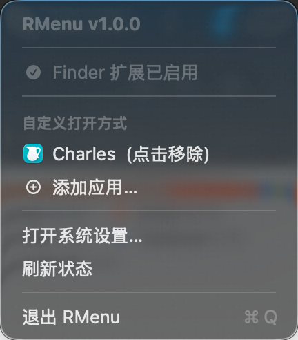
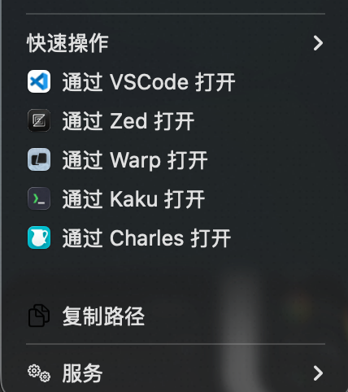

# RMenu

macOS Finder 右键菜单增强工具。基于 Finder Sync Extension，为 Finder 右键菜单添加快速打开应用、复制路径等实用功能。

## 截图

| 菜单栏管理 | Finder 右键菜单 |
|:---:|:---:|
|  |  |

## 功能

- **快速打开应用** - 右键直接通过 VSCode、Zed、Warp、Kaku 等应用打开文件/文件夹（自动检测已安装应用，显示对应图标）
- **复制路径** - 一键复制选中文件/文件夹的完整路径
- **自定义应用** - 通过菜单栏添加任意 `.app` 作为打开方式，可随时增删
- **菜单栏管理** - 查看扩展启用状态，管理自定义应用列表

## 系统要求

- macOS 14.0 (Sonoma) 及以上
- Xcode 15+ (从源码构建时)

## 安装

### 从 Release 下载

1. 在 [Releases](../../releases) 页面下载最新 `.dmg` 文件
2. 打开 DMG，将 `RMenu.app` 拖入 `Applications` 文件夹
3. 启动 `RMenu.app`
4. 在 **系统设置 > 登录项与扩展 > 添加的扩展** 中找到 RMenu，启用 Finder 扩展

### 从源码构建

**前置依赖：**

```bash
brew install xcodegen
```

**构建与安装：**

```bash
# 1. 生成 Xcode 项目
xcodegen generate

# 2. 构建（需要先创建自签名证书，见下方说明）
xcodebuild \
  -project RMenu.xcodeproj \
  -scheme RMenu \
  -configuration Debug \
  build \
  CODE_SIGN_IDENTITY="RMenu Development" \
  CODE_SIGNING_REQUIRED=YES \
  CODE_SIGNING_ALLOWED=YES \
  CONFIGURATION_BUILD_DIR="$(pwd)/build"

# 3. 安装到 ~/Applications 并激活扩展
cp -R build/RMenu.app ~/Applications/
open ~/Applications/RMenu.app
pluginkit -a ~/Applications/RMenu.app/Contents/PlugIns/RMenuExtension.appex
pluginkit -e use -i com.yeshan333.RMenu.FinderSyncExtension
killall Finder
```

**创建自签名证书（首次构建前执行一次）：**

```bash
# 生成证书
openssl req -x509 -newkey rsa:2048 \
  -keyout /tmp/rmenu-key.pem -out /tmp/rmenu-cert.pem \
  -days 365 -nodes -subj "/CN=RMenu Development"

# 打包为 p12
openssl pkcs12 -export \
  -out /tmp/rmenu-cert.p12 \
  -inkey /tmp/rmenu-key.pem -in /tmp/rmenu-cert.pem \
  -passout pass:rmenu

# 导入钥匙串
security import /tmp/rmenu-cert.p12 -P rmenu \
  -T /usr/bin/codesign

# 清理临时文件
rm -f /tmp/rmenu-key.pem /tmp/rmenu-cert.pem /tmp/rmenu-cert.p12
```

导入后，需要在 **钥匙串访问** 中找到 "RMenu Development" 证书，双击 > 信任 > 代码签名设为"始终信任"。

## 启用 Finder 扩展

首次安装后需手动启用扩展：

1. 打开 **系统设置**
2. 进入 **登录项与扩展** > **添加的扩展**
3. 找到 **RMenu**，开启 Finder 扩展开关

启用后在 Finder 中右键即可看到 RMenu 菜单项。

## 使用

### 菜单栏

启动后 RMenu 以菜单栏图标形式运行，点击可以：

- 查看 Finder 扩展启用状态（自动检测，无需手动刷新）
- 添加/移除自定义打开应用
- 快速跳转系统设置页面

### 右键菜单

在 Finder 中对文件或文件夹右键，菜单中会出现：

- **通过 XXX 打开** - 已安装的内置应用（VSCode、Zed、Warp、Kaku）及自定义添加的应用
- **复制路径** - 将选中项的完整路径复制到剪贴板

## 项目结构

```
r-menu/
├── project.yml                 # XcodeGen 项目配置
├── RMenu/                      # 主应用（菜单栏）
│   ├── RMenuApp.swift          # App 入口
│   ├── MenuBarView.swift       # 菜单栏 UI
│   ├── ExtensionStatus.swift   # 扩展状态检测
│   ├── Info.plist
│   └── RMenu.entitlements
├── RMenuExtension/             # Finder Sync 扩展
│   ├── FinderSync.swift        # 扩展入口 & 右键菜单构建
│   ├── AppLocator.swift        # 应用定位检测
│   ├── Actions/
│   │   ├── OpenAppAction.swift # 打开应用动作
│   │   └── CopyPathAction.swift# 复制路径动作
│   ├── Info.plist
│   └── RMenuExtension.entitlements
├── Shared/                     # 两个 Target 共享代码
│   ├── Constants.swift         # 常量 & ExternalApp 模型
│   └── CustomAppStore.swift    # 自定义应用持久化（JSON）
├── scripts/
│   └── create-dmg.sh           # DMG 打包脚本
└── .github/workflows/
    └── build.yml               # CI: 自动构建 & 发布 DMG
```

## CI/CD

项目使用 GitHub Actions 自动构建和发布：

- **推送 `v*` tag** 时自动触发构建，生成 DMG 并创建 GitHub Release
- 支持 **手动触发**（Actions > Build & Package DMG > Run workflow）

```bash
# 发布新版本
git tag v1.0.0
git push origin v1.0.0
```

## 技术实现

- **Finder Sync Extension** (`FIFinderSync`) 注入右键菜单项
- **SwiftUI MenuBarExtra** 实现菜单栏管理界面
- **App Sandbox** 启用以满足 macOS 扩展加载要求
- **XcodeGen** 管理项目配置，避免 `.xcodeproj` 冲突
- 内置应用列表在扩展初始化时缓存，图标懒加载并缓存，确保右键菜单响应迅速
- 自定义应用配置通过 JSON 文件在主应用与扩展间共享

## License

MIT
